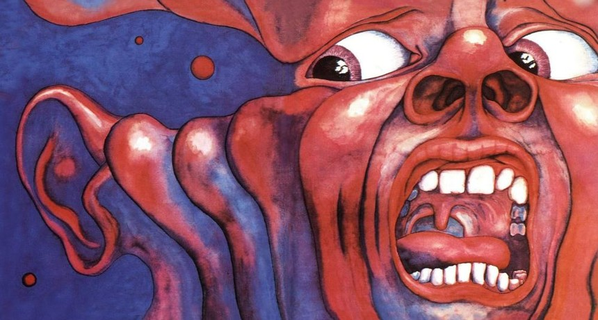

# Translation of King Crimson's _In the Court of the Crimson King_

While some bands and their legacies result in the creation of devoted followings, that of King Crimson can be described as borderline fanatic. This may be partially attributed to the massively successful release of their 1969 debut, _In the Court of the Crimson King_; however, every one of their albums left a mark not only on the development of progressive music, but also on the broader musical landscape of the late ’60s, ’70s, and ’80s - think Frippertronics as an example.

Progressive rock did not begin with King Crimson, but their debut was pivotal—and, much like the lyrics of Dylan and Lennon from the same era, it carried an embedded anti-war message, if not several. The writing of Peter Sinfield is phenomenal; “The Letters”, in particular, is one of my favourites. The cultural and poetic depth of his work poses a challenge even to the most skilled translators.

Although I am not a professional translator, but rather a student of translation, I have chosen to render one of his works—"Moonchild"—into Polish, my native language. First is the original, followed by my take on it.
 
**King Crimson – Moonchild** 
 
*Call her moonchild* 
*Dancing in the shallows of a river* 
*Lonely moonchild* 
*Dreaming in the shadows of the willow* 
*Talking to the trees of the cobweb strange* 
*Sleeping on the steps of a fountain* 
*Waving silver wands to the night birds song* 
*Waiting for the sun on the mountain* 
*She's a moonchild* 
*Gathering the flowers in a garden* 
*Lovely moonchild* 
*Drifting on the echoes of the hours* 
*Sailing on the wind in a milk white gown* 
*Dropping circle stones on a sun dial* 
*Playing hide and seek with the ghosts of dawn* 
*Waiting for a smile from a sun child* 
 
**King Crimson – Księżycowa Córa** 
 
*Nazywają ją księżycową córą* 
*Pląsa ona w lekkim strumieniu rzeki* 
*Tak bardzo samotna* 
*Marzy w cieniu wierzby* 
*Jej szept uchwyca drzew pajęczyna* 
*Sypia u podnóża leśnego źródła* 
*Dyryguje nocnym śpiewem słowików* 
*Wyczekując pierwszego promienia o brzasku* 
*Księżycowa córa* 
*Zbiera upadłe płatki kwiatów* 
*Urocze dziecię* 
*Dryfuje po pogłosie minionego czasu* 
*W śnieżnobiałej sukni ponosi ją wiatr* 
*Z kamieni układa słoneczny zegar* 
*Bawiąc się w chowanego z duchem jutrzenki* 
*Aż dostrzeże uśmiech dziecka słońca* 

